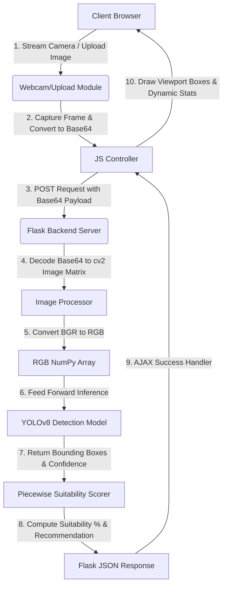

# MBG Freshness AI — YOLOv8 Object Detection Version

[](https://www.python.org/)
[](https://github.com/ultralytics/ultralytics)
[](https://pytorch.org/)
[](https://flask.palletsprojects.com/)

An editorial, real-time AI-powered freshness object detection web application tailored for the **Makan Bergizi Gratis (MBG)** national program. Built using **Ultralytics YOLOv8 Object Detection** and served via a lightweight, high-performance Flask backend with a premium, responsive web interface.

Developed by **Kelompok 11 — Politeknik Caltex Riau**: Ghaswul Fikri Fadhillah (<ghaswul23ti@mahasiswa.pcr.ac.id>), Daffa Hadziq (<daffa23ti@mahasiswa.pcr.ac.id>), and Dafi Hibrizi (<dafi23ti@mahasiswa.pcr.ac.id>).

---

## System Architecture & Workflow

Here is how the components interact in the MBG Freshness AI YOLO application:



### System Workflow Description
1. **Frontend Capture:** The browser captures real-time video frames from the webcam or processes uploaded files, rendering the output on a `<canvas>`.
2. **Data Transmission:** Every frame is serialized into a Base64 string and sent asynchronously via the Fetch API to the `/predict_frame` backend endpoint.
3. **Backend Processing:** Flask receives the payload, decodes it into a standard OpenCV image matrix (`numpy` array), and converts the channels from BGR to RGB.
4. **AI Inference:** The trained **YOLOv8 Object Detection** model (`runs/detect_freshness/weights/best.pt`) predicts bounding boxes and class labels (`fresh` / `rotten`) for each ingredient.
5. **Suitability Scoring:** The relative ratio of fresh versus rotten items in the frame is evaluated and mapped to a percentage suitability index using a custom piecewise linear algorithm.
6. **UI Rendering:** The result is returned as JSON to the client, which dynamically renders neon bounding boxes around each detected fruit, updates average session statistics, logs recent items, and updates the dynamic suitability score bar without page reloads.

---

## Key Features

### 1. Real-time Video Inference
* **Webcam Streaming:** Scans raw food ingredients via the device webcam.
* **Media Uploads:** Supports scanning via uploaded static images or pre-recorded videos.
* **Scan Viewport Effects:** Interactive neon scanning lines and color-coded bounding boxes representing prediction status (green for `segar` / `fresh`, red for `tidak_segar` / `rotten`).

### 2. Consumption Suitability Index
* **Piecewise Linear Scoring:** Calculates a precise percentage suitability score based on fruit counts and detection confidence.
* **Actionable UX Recommendations:** Displays smart warnings based on safety thresholds (e.g., highly fresh, consume today, or discard/compost).

### 3. Interactive Floating "Dynamic Island" Navbar
* **Scroll-Responsive Capsule:** Smoothly morphs from a full header down to a compact floating capsule on scroll to maximize viewport estate.
* **Pulse & Glow States:** Border glows green dynamically during active AI inference.
* **Mobile-First Design:** Autocompacts on mobile viewports (< 768px) to fit all screen sizes perfectly.

### 4. Interactive Statistics & History
* **Live Session Metrics:** Displays total items scanned, average object detection confidence, and total count stats of fresh and rotten ingredients.
* **Scan Log:** Interactive time-stamped history list showing the 20 most recent prediction outcomes.

### 5. Training Report Dashboard
* **val_accuracy & val_loss metrics:** Shows key performance results from training logs.
* **Interactive Evaluation Charts:** Embeds training accuracy curves, training loss curves, and the evaluation confusion matrix.
* **Persisted Dark & Light Mode:** Switches themes smoothly with high-contrast neon stabilo highlights that persist across page reloads.

---

## Installation & Setup

### 🛠️ Langkah 1: Penyiapan Dataset
1. Unduh dataset format **YOLOv8** dari Roboflow.
2. Ekstrak file zip dan tempatkan foldernya di dalam project dengan nama `yolo_detection_dataset`.
   Strukturnya harus berupa:
   ```text
   yolo_detection_dataset/
   ├── train/
   ├── valid/
   ├── test/
   └── data.yaml
   ```

### 🚀 Langkah 2: Pelatihan Model (Training)
Buka Jupyter Notebook [2_model_training.ipynb](file:///c:/Punya%20GW/Kuliah/ProjectKel11_YOLO/2_model_training.ipynb) dan **Jalankan semua sel (Run All)**.
Notebook ini akan otomatis mengunduh base model `yolov8n.pt`, melatih model Object Detection selama 25 epoch, dan mengekspor weights terbaik ke `runs/detect_freshness/weights/best.pt`.

### 🌐 Langkah 3: Menjalankan Aplikasi Web
Setelah training selesai dan file `best.pt` terbentuk, jalankan perintah berikut di terminal:
```bash
cd "c:\Punya GW\Kuliah\ProjectKel11_YOLO"
pip install -r requirements.txt
python web/app.py
```
Buka browser dan buka **`http://localhost:8080`**.
